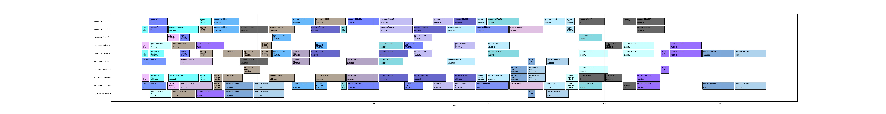

# Dandori: Next-Gen Scheduler

Dandori is a revolutionary scheduling tool designed to optimize manufacturing processes using advanced mathematical algorithms. By leveraging Directed Acyclic Graphs (DAGs) for item recipes and incorporating real-time process data such as durations and machine assignments, Dandori enhances operational efficiency and minimizes makespan across various manufacturing environments.



## Table of Contents

- [Features](#features)
- [Installation](#installation)
- [Usage](#usage)
- [Configuration](#configuration)
- [Examples](#examples)
- [Technologies Used](#technologies-used)
- [Contributing](#contributing)
- [License](#license)
- [Contact](#contact)

## Features

- **Optimized Scheduling:** Utilizes advanced algorithms to optimize production schedules.
- **Directed Acyclic Graphs (DAGs):** Represents item recipes with DAGs to streamline process flows.
- **Real-Time Data Integration:** Incorporates process durations and machine assignments for accurate scheduling.
- **Scalability:** Adaptable to various manufacturing environments and scales with the complexity of operations.
- **User-Friendly Interface:** Easy-to-use interface for configuring and monitoring schedules.

## Installation

To install Dandori, follow these steps:

1. **Clone the repository:**
    ```bash
    git clone https://github.com/yourusername/dandori.git
    ```
2. **Navigate to the project directory:**
    ```bash
    cd dandori
    ```
3. **Install the required dependencies:**
    ```bash
    pip install -r requirements.txt
    ```

## Usage

1. **Prepare your data:**
    - Ensure your manufacturing data, including item recipes, process durations, and machine assignments, is in the required format.

2. **Run Dandori:**
    ```bash
    python dandori.py
    ```

3. **Configure your scheduling parameters:** 
    - Adjust settings such as optimization goals, constraints, and priorities in the configuration file.

4. **Monitor and analyze schedules:**
    - Use the user-friendly interface to review and adjust the generated schedules.

## Configuration

Dandori requires a configuration file to specify scheduling parameters. Below is an example configuration file (`config.yaml`):

```yaml
optimization:
  goal: minimize_makespan
  constraints:
    - machine_capacity
    - process_duration

data_sources:
  recipes: path/to/recipes.csv
  process_durations: path/to/durations.csv
  machine_assignments: path/to/machines.csv

output:
  schedule: path/to/schedule_output.csv
